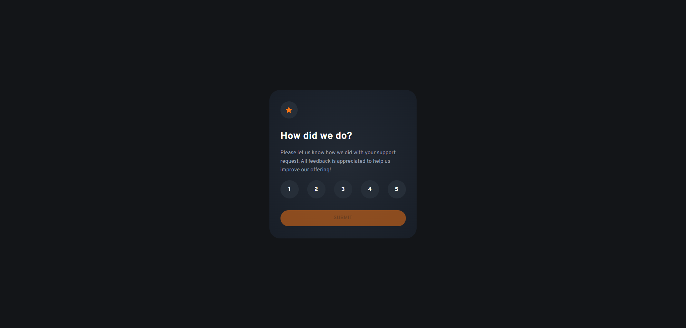

<h1 align="center">Interactive rating component</h1>

Solution to the Frontend Mentor challenge

  

This is a solution to the [Interactive rating component challenge on Frontend Mentor](https://www.frontendmentor.io/challenges/interactive-rating-component-koxpeBUmI). Frontend Mentor challenges help you improve your coding skills by building realistic projects.

## Screenshot

Desktop view (1920px wide)

## Features

Users should be able to:
- View the optimal layout for the app depending on their device's screen size
- See hover states for all interactive elements on the page
- Select and submit a number rating
- See the "Thank you" card state after submitting a rating

## Built with

- HTML
- CSS
- JavaScript

## Links

- Solution URL: 
- Live Site URL: 

## Author

Find me on other platforms!

- Frontend Mentor: [@AverageBaguetteEnjoyer](https://www.frontendmentor.io/profile/AverageBaguetteEnjoyer)
- CodeWars: [AverageBaguetteEnjoyer](https://www.codewars.com/users/AverageBaguetteEnjoyer)
- Coddy: [@baguetteenjoyer](https://coddy.tech/user/baguetteenjoyer?via=share_profile)